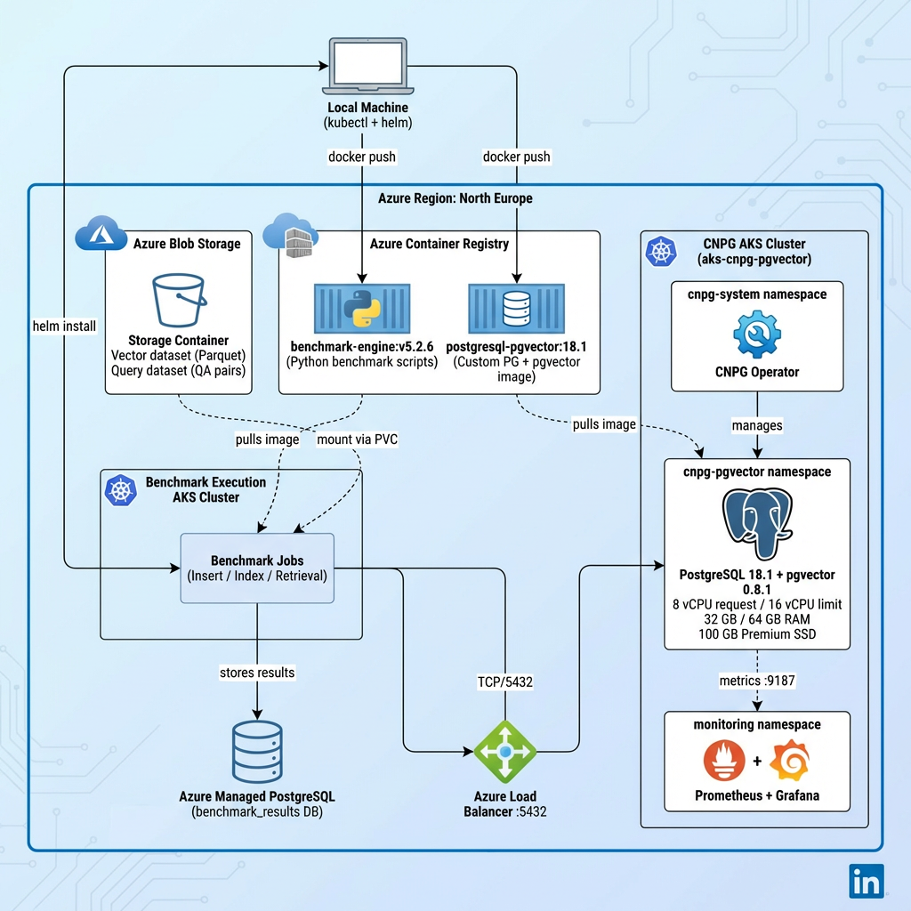
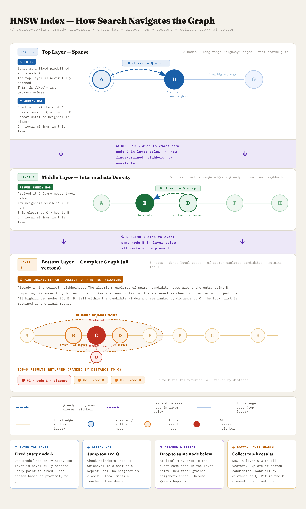
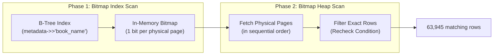
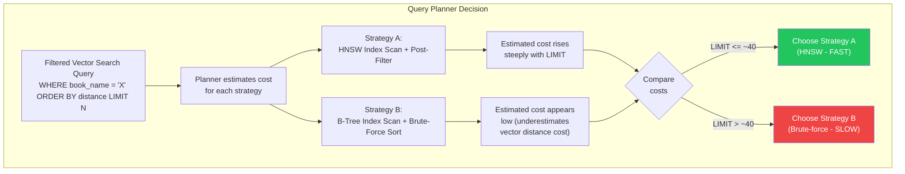
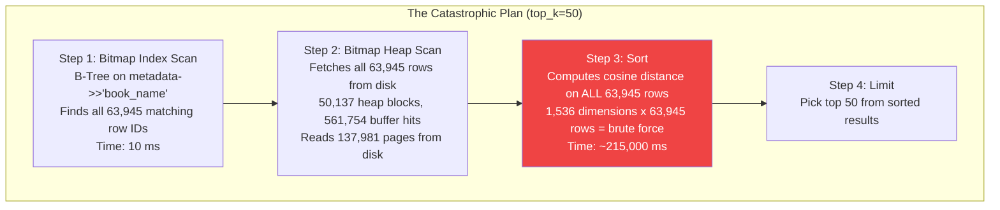
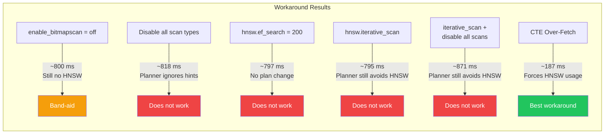
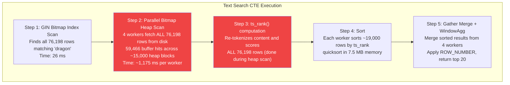

# Cloud-Native PostgreSQL as a Production Vector Database on Kubernetes: Infrastructure, Hidden Performance Traps, and Workarounds

_A deep investigation into when pgvector abandons HNSW indexes, the query planner behavior that breaks filtered search at production scale, and the workarounds that actually work._

## Introduction

As businesses increasingly adopt generative AI, the vector database has emerged as arguably the most critical infrastructure component in the modern AI stack. Because most production-grade systems rely on hosted APIs from LLM providers rather than provisioning their own models, the vector database - which grounds these models in proprietary data via Retrieval-Augmented Generation (RAG) - becomes the central piece of infrastructure you must actually manage and scale.

The appeal of using PostgreSQL with pgvector for this is obvious: use your existing relational database, avoid operating a separate specialized vector database, and leverage decades of SQL ecosystem maturity. For many use cases, this works well.

But when moving from prototyping to production-grade workloads and scaling pgvector to millions of vectors, I discovered two distinct performance problems that remain invisible at a smaller scale:

1. **Filtered search cliff**: Queries went from **83 milliseconds** to over **215 seconds**, a **2,500x degradation**, triggered by nothing more than changing the `LIMIT` clause (for example, requesting 50 nearest neighbors instead of 10). This catastrophic fall-off does not happen in pure vector search; it only occurs when combining vector search with **metadata filtering**. The root cause is a flaw in the query planner's cost calculation. Up to a certain number of requested nearest neighbors, it efficiently uses the HNSW vector index. But at a specific `LIMIT` threshold - which depends completely on what percentage of your dataset matches the filter condition - the planner miscalculates the cost of post-filtering versus pre-filtering. Once you cross this hidden threshold, it suddenly abandons the HNSW index in favor of a B-tree metadata index scan, forcing a massive brute-force vector distance calculation on every single matching row.
2. **Hybrid search bottleneck**: Even at low `top_k`, hybrid search (vector + full-text via RRF) is consistently **3 to 4x slower** than pure vector search, with the full-text search component consuming over 90% of query time. This happens because PostgreSQL's GIN index for full-text search operates on a "fetch all, score all, sort all" pattern. While it can efficiently find all rows containing a keyword, it cannot inherently rank them by relevance (`ts_rank()`). To return even the top 10 results, the database must fetch every matching row from disk, re-tokenize the text to compute the rank, and sort the entire matching set, which creates large overhead compared to a graph-based vector index.

This article walks through the full technical investigation that uncovered the root cause of both problems, with `EXPLAIN ANALYZE` evidence at every step. It also dives into possible workarounds and provides guidance to evaluate whether your dataset and query patterns in production are likely to hit these issues. Here is what you will get from it:

- **Production-grade cloud-native infrastructure**: A complete blueprint for deploying PostgreSQL with pgvector on a self-hosted AKS cluster using the CloudNativePG operator, a real-world reference architecture, not a local-machine prototype.
- **Python async client patterns**: How to use `asyncpg` for high-concurrency vector retrieval, index creation, and bulk data ingestion via PostgreSQL's binary `COPY` protocol.
- **Full observability stack**: Prometheus and Grafana setup with custom PostgreSQL metrics dashboards, so you can see exactly how CPU, memory, I/O, and query performance behave under load, the same monitoring that captured the real-time evidence of the performance cliff in this investigation.
- **Quantitative evidence at scale**: Every claim is backed by data from 2.5 million vectors at 1,536 dimensions, with systematic sweeps across concurrency levels and `top_k` values. Prometheus metrics and `EXPLAIN ANALYZE` output demonstrate precisely where and why the failure occurs.
- **Seven workaround strategies, tested and documented**: Each approach is evaluated with results, so you do not have to discover through trial and error which ones actually work and which ones the query planner silently ignores.
- **Dataset-agnostic benchmarking framework**: If you want to evaluate whether your own dataset and query patterns will hit this limitation, you can point the included framework at your own vectors and filters to find your specific tipping points, the exact `top_k` threshold where the planner abandons the HNSW index for your data distribution, before it surprises you in production.

---

## The Setup

### Infrastructure Architecture

I ran this investigation on a self-hosted PostgreSQL cluster on Azure Kubernetes Service (AKS), managed by the **CloudNativePG (CNPG) operator**. The architecture uses two separate AKS clusters: one dedicated to hosting the PostgreSQL database, and another dedicated to running the benchmark workloads. Both clusters are deployed in the **same Azure region (`northeurope`)** to rule out geographic latency as a variable in the benchmark results. In a production system, your client application would typically run on the same AKS cluster as the CloudNativePG-managed PostgreSQL instance, communicating over the cluster-internal network. Here, the separation into two clusters is intentional: it isolates benchmark workload resource consumption from the database, ensuring that CPU and memory measurements on the database node reflect only PostgreSQL's behavior.

<p align="center">
  
</p>

The architecture has four layers. At the infrastructure level, two AKS clusters provide compute isolation: one hosts only the PostgreSQL database (managed by the CloudNativePG operator), while the other runs benchmark workloads as Kubernetes Jobs. Azure Container Registry stores both Docker images (the custom PostgreSQL + pgvector image and the Python benchmark engine) while Azure Blob Storage holds the Parquet datasets, mounted into benchmark pods via PersistentVolumeClaims. Prometheus and Grafana run on the database cluster to capture PostgreSQL-specific metrics (cache hit ratio, sequential vs index scans, lock contention, WAL throughput) during benchmark execution. All benchmark jobs are submitted from a local machine via `helm install`, which creates Kubernetes Jobs on the benchmark cluster. These jobs connect to the PostgreSQL instance over the Azure Load Balancer, execute the insert, index creation, and retrieval benchmarks, and write structured results (QPS, latency percentiles, throughput) to a separate Azure Managed PostgreSQL instance for post-execution analysis and visualization.

**CNPG AKS Cluster (`aks-cnpg-pgvector`):**

- **Node**: Azure `Standard_D16s_v3` (16 vCPUs, 64 GB RAM)
- **Operator**: CloudNativePG (CNPG) v1.x, installed via Helm
- **PostgreSQL**: 18.1 with pgvector 0.8.1, running a custom Docker image from ACR
- **Storage**: 100 GB Azure Premium SSD (`managed-csi-premium`)
- **Monitoring**: Prometheus + Grafana dashboards for real-time CPU, memory, I/O, and query metrics

**Benchmark Execution Cluster (`benchmark-execution-aks`):**

- A separate AKS cluster running benchmark jobs as Kubernetes Jobs via Helm charts
- **Node**: Azure `Standard_D8s_v3` (8 vCPUs, 32 GB RAM)
- Benchmark jobs are submitted from a local machine via `helm install` with configurable values files
- Pulls the benchmark engine Docker image from ACR
- Mounts vector and query datasets from Azure Blob Storage via a PersistentVolumeClaim
- Connects to the CNPG cluster over an Azure Load Balancer on port 5432
- Results stored in an Azure Managed PostgreSQL instance for analysis

**Azure Container Registry (ACR):**

- `postgresql-pgvector:18.1`: Custom PostgreSQL 18.1 image with pgvector 0.8.1 built on the CNPG base image
- `benchmark-engine:v5.2.6`: Python benchmark suite packaged with `uv` for dependency management

**Azure Blob Storage:**

- Contains the vector dataset (2.5 million embeddings in Parquet format) and the query dataset (QA pairs for retrieval benchmarks), mounted into benchmark jobs as a Kubernetes PersistentVolume

### Replicating the Infrastructure

The full infrastructure setup is documented in dedicated guides within the `doc/` directory. If you want to replicate this environment from scratch, follow these guides in order:

1.  **[CNPG_PGVECTOR_SETUP.md](doc/CNPG_PGVECTOR_SETUP.md)**: Creating the dedicated AKS cluster, installing the CloudNativePG operator, building the custom PostgreSQL + pgvector Docker image, deploying the PostgreSQL cluster via CRD (with tuned parameters for vector workloads), exposing PostgreSQL via LoadBalancer, and verifying the pgvector extension.
2.  **[CNPG_MONITORING_SETUP.md](doc/CNPG_MONITORING_SETUP.md)**: Deploying the Prometheus + Grafana observability stack, configuring CNPG PodMonitors and custom PostgreSQL metrics queries (cache hit ratio, sequential vs index scans, lock contention, WAL stats), importing the Grafana dashboard, and a comprehensive metrics interpretation guide for every dashboard panel.
3.  **[execution-guide.md](doc/execution-guide.md)**: Provisioning the benchmark execution AKS cluster, creating Azure Container Registry and image pull secrets, setting up Azure Files storage with PersistentVolumeClaims for dataset mounting, creating Kubernetes secrets for PostgreSQL connectivity (both the CNPG target and the results database), building and pushing the benchmark engine Docker image, running insert / index / retrieval benchmarks as Helm-deployed Kubernetes Jobs, and querying the results database.

Each guide is self-contained with exact commands, expected outputs, and troubleshooting steps.

**Key infrastructure files referenced by these guides:**

- [**Dockerfile**](infrastructure/cnpg-pgvector/Dockerfile) (`infrastructure/cnpg-pgvector/`): Custom PostgreSQL 18.1 + pgvector 0.8.1 image built on the CNPG base
- [**cluster.yaml**](infrastructure/cnpg-pgvector/cluster.yaml) (`infrastructure/cnpg-pgvector/`) — CNPG Cluster CRD with tuned PostgreSQL parameters for vector workloads
- [**values-prometheus-grafana.yaml**](infrastructure/cnpg-pgvector/monitoring/values-prometheus-grafana.yaml) (`infrastructure/cnpg-pgvector/monitoring/`): Helm values for the `kube-prometheus-stack` deployment for the cnpg-pgvector cluster observability
- [**cnpg-extra-monitoring.yaml**](infrastructure/cnpg-pgvector/monitoring/cnpg-extra-monitoring.yaml) (`infrastructure/cnpg-pgvector/monitoring/`): Custom SQL queries exposed as CNPG Prometheus metrics (cache hit ratio, connection states, lock contention, scan types)
- [**cnpg-podmonitor.yaml**](infrastructure/cnpg-pgvector/monitoring/cnpg-podmonitor.yaml) (`infrastructure/cnpg-pgvector/monitoring/`): PodMonitor telling Prometheus to scrape CNPG metrics on port 9187
- [**cnpg-pgvector-overview.json**](infrastructure/cnpg-pgvector/monitoring/dashboards/cnpg-pgvector-overview.json) (`infrastructure/cnpg-pgvector/monitoring/dashboards/`): Grafana dashboard JSON with 10 panel rows covering cluster health, node resources, query performance, connections, buffer cache, checkpoints, WAL, table sizes, and I/O
- [**Dockerfile**](infrastructure/docker/Dockerfile) (`infrastructure/docker/`): Benchmark engine Docker image built with `uv` for dependency management

---

## The Dataset

The _Wheel of Time_ (WoT) is a high fantasy book series by Robert Jordan and Brandon Sanderson, spanning **14 novels plus a prequel**, over 4.4 million words in total. I regularly use this corpus for my RAG, vector database, and generative AI experiments because of its scale and richly interconnected world-building: it produces a large number of semantically dense text chunks with natural metadata partitioning (by book, by chapter) and a wide variety of searchable concepts: characters, locations, events, and magic system terminology.

The base dataset contains **100,105 real text chunk embeddings** generated using OpenAI's `text-embedding-ada-002` model (1,536 dimensions). To test pgvector at production scale, I synthetically expanded this to **2.5 million vectors** by duplicating text chunks with varied metadata combinations and generating synthetic embeddings, preserving the original data distribution characteristics while reaching a dataset size that stresses PostgreSQL's query planner and buffer cache.

The benchmark uses two Parquet datasets stored in Azure Blob Storage:

- **Vector dataset** (2.5 million rows): Each row contains the text chunk (`text`), its 1,536-dimensional embedding (`embedding`), and metadata fields (`book_name`, `chapter_number`, `chapter_title`). On insert, each row maps to a PostgreSQL table with `content text`, `metadata jsonb`, and `embedding vector(1536)` columns.
- **Query dataset** (4,373 rows): Real questions about the Wheel of Time, each containing a `query_embedding`, extracted `keywords` for hybrid search, and a `filter_field`/`filter_value` pair for filtered search. Every query row is used across all three benchmark search patterns (vector, filtered, and hybrid) without any modification.

The `metadata->>'book_name'` field has **16 distinct values** (one per book), with the smallest book containing 63,945 rows (2.6%) and the largest containing 209,226 rows (8.4%). This uneven distribution tests the query planner's behavior across different filter selectivities.

The benchmark framework is **dataset-agnostic**: you can point it at your own Parquet files and a YAML configuration to find the exact `top_k` threshold where the planner abandons the HNSW index for your data distribution. For full dataset schemas and bring-your-own-dataset instructions, see [DATASET.md](doc/DATASET.md).

---

## The Benchmark

Before running retrieval benchmarks, the data must be ingested and indexed. Data ingestion uses PostgreSQL's `COPY` command with binary format via `psycopg3`, which achieves 10 to 50x faster throughput than standard `INSERT` statements; the full 2.5 million row insert completed in approximately 27 minutes. Three indexes are then created on the table: an **HNSW index** on the embedding column for approximate nearest neighbor search (`m = 16`, `ef_construction = 64`), a **B-tree expression index** on `metadata->>'book_name'` for filtered search, and a **GIN index** on `to_tsvector('english', content)` for full-text search. The HNSW index build on 2.5 million 1,536-dimensional vectors took approximately 4 hours and 45 minutes.

**Benchmark scripts** (`src/pgvector/`):

- [**01_insert_benchmark_copy.py**](src/pgvector/01_insert_benchmark_copy.py): Bulk data ingestion using PostgreSQL's binary `COPY` protocol via psycopg3. Sets up the database table (`CREATE TABLE` with `content text`, `metadata jsonb`, `embedding vector(1536)`), loads Parquet data in configurable chunks, and streams rows to PostgreSQL. This is the recommended insert method for large datasets.
- [**01_insert_benchmark.py**](src/pgvector/01_insert_benchmark.py): Standard row-by-row `INSERT` benchmark for cross-database comparison (matches the insert pattern used with Milvus and MongoDB benchmarks).
- [**02_create_indexes.py**](src/pgvector/02_create_indexes.py): Creates HNSW, B-tree, and GIN indexes with configurable parameters. Measures and logs index build times to the results database for each index type.
- [**03_retrieval_asyncpg.py**](src/pgvector/03_retrieval_asyncpg.py) — Primary retrieval benchmark using the asyncpg driver. Runs all three search patterns (vector, filtered, hybrid) across configurable concurrency levels and `top_k` values, measuring QPS and latency percentiles (p50, p95, p99). Uses connection pooling with `asyncpg.create_pool()`.
- [**03_retrieval_psycopg3_async.py**](src/pgvector/03_retrieval_psycopg3_async.py) — Retrieval benchmark using psycopg3's async interface, for driver comparison against asyncpg.
- [**03_retrieval_psycopg3_sync.py**](src/pgvector/03_retrieval_psycopg3_sync.py) — Synchronous retrieval benchmark using psycopg3, for baseline comparison without async overhead.
- [**03_retrieval_psycopg2_sync.py**](src/pgvector/03_retrieval_psycopg2_sync.py) — Synchronous retrieval benchmark using psycopg2, the most widely-used PostgreSQL driver.
- [**common.py**](src/pgvector/common.py) — Shared configuration module: database connection management, SQL query templates for all three search patterns (vector, filtered, hybrid), environment variable handling, and connection pool sizing.

**Helm chart and Kubernetes manifests:**

The benchmark engine is deployed as Kubernetes Jobs using a custom Helm chart. The chart creates a Job with a ConfigMap for environment variables, mounts the dataset PVC, and injects secrets for database connectivity. Different benchmark scenarios are configured through example values files that override the chart defaults:

- [**Chart.yaml**](kube/charts/benchmark-engine/Chart.yaml) — Helm chart metadata
- [**values.yaml**](kube/charts/benchmark-engine/values.yaml) — Default chart values: image config, resource limits (2 CPU / 8 GB), dataset PVC mount, environment variables (dataset paths, batch sizes, results database config), and external secrets references
- [**job.yaml**](kube/charts/benchmark-engine/templates/job.yaml) — Job template that wires the container command, ConfigMap envFrom, secret envFrom, and PVC volume mount
- [**configmap.yaml**](kube/charts/benchmark-engine/templates/configmap.yaml) — ConfigMap template that merges all `env` values into a single Kubernetes ConfigMap
- [**pvc.yaml**](kube/pvc.yaml) — PersistentVolume and PersistentVolumeClaim for mounting Azure Files storage into benchmark pods

**Example values files** (each overrides the defaults for a specific benchmark scenario):

- [**insert-cnpg-pgvector.yaml**](kube/charts/benchmark-engine/examples/insert-cnpg-pgvector.yaml) — Standard row-by-row INSERT benchmark
- [**insert-cnpg-pgvector-copy.yaml**](kube/charts/benchmark-engine/examples/insert-cnpg-pgvector-copy.yaml) — Binary `COPY` INSERT benchmark (10-50x faster, recommended for 2.5M scale)
- [**index-cnpg-pgvector.yaml**](kube/charts/benchmark-engine/examples/index-cnpg-pgvector.yaml) — HNSW + B-tree + GIN index creation
- [**retrieval-cnpg-pgvector-asyncpg.yaml**](kube/charts/benchmark-engine/examples/retrieval-cnpg-pgvector-asyncpg.yaml) — Vector, filtered, and hybrid search retrieval benchmark using asyncpg

Each benchmark runs as a Kubernetes Job deployed via Helm. The Helm values file defines the script to run, dataset configuration, and connection parameters:

```yaml
# retrieval-cnpg-pgvector-asyncpg.yaml
command: ["python", "src/pgvector/03_retrieval_asyncpg.py"]
env:
  DATASET_SIZE: "2500000"
  TABLE_NAME: "wot_chunks_2_5m"
  CONCURRENCY_LEVELS: "1,2,4,8,16,32,50,100"
  TOP_K_VALUES: "1,5,10,20,50,100"
  BENCHMARK_NUM_QUERIES: "4373"
  DATABASE_NAME_OVERRIDE: "PostgreSQL CNPG Self-Hosted"
```

```bash
# Deploy a retrieval benchmark job
kubectl config use-context benchmark-execution-aks

helm install cnpg-pg-retrieval-asyncpg-wot-2m5 \
    ./kube/charts/benchmark-engine \
    -f kube/charts/benchmark-engine/examples/retrieval-cnpg-pgvector-asyncpg.yaml \
    --set image.repository=$ACR_NAME.azurecr.io/$IMAGE_NAME \
    --set image.tag=$TAG
```

The retrieval benchmark ([03_retrieval_asyncpg.py](src/pgvector/03_retrieval_asyncpg.py)) tests three search patterns at varying concurrency levels (1, 2, 4, 8, 16, 32, 50, 100 concurrent queries) and `top_k` values (1, 5, 10, 20, 50, 100):

### 1. Vector Search (Pure ANN)

```python
query = f"""
    SELECT id, 1 - (embedding <=> $1) AS similarity
    FROM {TABLE_NAME}
    ORDER BY embedding <=> $1
    LIMIT {top_k}
"""
await conn.fetch(query, query_embedding)
```

### 2. Filtered Search (Vector + Metadata Filter)

```python
query = f"""
    SELECT id, 1 - (embedding <=> $1) AS similarity
    FROM {TABLE_NAME}
    WHERE metadata->>'{filter_field}' = $2
    ORDER BY embedding <=> $1
    LIMIT {top_k}
"""
await conn.fetch(query, query_embedding, filter_value)
```

### 3. Hybrid Search (Vector + Full-Text via RRF)

```python
query = f"""
    WITH vector_search AS (
        SELECT id,
               ROW_NUMBER() OVER (ORDER BY embedding <=> $1) as rank,
               1 - (embedding <=> $1) as vector_similarity
        FROM {TABLE_NAME}
        LIMIT {vector_limit}
    ),
    text_search AS (
        SELECT id,
               ROW_NUMBER() OVER (ORDER BY ts_rank(
                   to_tsvector('english', content),
                   plainto_tsquery('english', $2)
               ) DESC) as rank,
               ts_rank(to_tsvector('english', content),
                       plainto_tsquery('english', $2)) as text_score
        FROM {TABLE_NAME}
        WHERE to_tsvector('english', content)
              @@ plainto_tsquery('english', $2)
        LIMIT {vector_limit}
    ),
    rrf_scores AS (
        SELECT COALESCE(v.id, t.id) as id,
               (COALESCE(1.0 / (60 + v.rank), 0.0)
              + COALESCE(1.0 / (60 + t.rank), 0.0)) as rrf_score
        FROM vector_search v
        FULL OUTER JOIN text_search t ON v.id = t.id
    )
    SELECT id, rrf_score as similarity
    FROM rrf_scores
    ORDER BY rrf_score DESC
    LIMIT {top_k}
"""
```

The benchmark driver uses Python's `asyncpg` with connection pooling and semaphore-based concurrency control. Each test scenario runs 4,373 queries using real embeddings sampled from the dataset.

---

## Understanding the Key PostgreSQL Concepts

Before diving into the benchmark results and the performance cliff, it is important to understand the PostgreSQL internals involved. These concepts are essential to grasping why the problem occurs.

### HNSW Index

HNSW (Hierarchical Navigable Small World) is a graph-based approximate nearest neighbor (ANN) index. pgvector implements it as a PostgreSQL access method, allowing `ORDER BY embedding <=> $1 LIMIT k` queries to be answered by traversing a prebuilt graph instead of scanning every row in the table.

The core idea is a multi-layer graph that works a lot like zooming in on a map. Each vector in your table becomes a "node" in this graph, connected to its nearest neighbors by edges. 
- **The top layer** contains only a tiny, random subset of nodes (like major cities on a map) connected by long "highways". This allows the search to quickly jump across the vector space.
- **The middle layers** contain progressively more nodes.
- **The bottom layer (Layer 0)** contains absolutely every vector in the table, connected by short, dense local roads.

This layered structure enables a fast "coarse-to-fine" search:

<p align="center">
  
</p>

> For the full interactive version of this diagram, see [doc/hnsw-graph.html](doc/hnsw-graph.html).

**How the search algorithm navigates this graph:**

1. **Enter the top layer**: The search starts at a single, predefined entry node in the topmost layer. It does not scan all nodes in this layer.
2. **Greedy search**: At the current node, the algorithm calculates the distance between the query vector and all of the node's connected neighbors. If one of those neighbors is closer to the query than the current node is, the algorithm jumps to that neighbor. It repeats this "greedy" hopping process until it reaches a node where *none* of the connected neighbors are closer to the query.
3. **Descend**: Once it can't get any closer at the current layer, it drops down to the **exact same node** in the layer below. Because the layer below has more nodes and connections, the node it just dropped into now has new, finer-grained neighbors to explore. It resumes the greedy search from there.
4. **Bottom layer search**: By the time it descends to Layer 0 (which contains all data), it is already in the correct "neighborhood". It explores this local area thoroughly, keeping a list of the best `k` candidates it finds.

The total number of distance comparisons is logarithmic in the dataset size, which is what makes HNSW dramatically faster than a sequential scan.

**Key parameters:**

- **`m`** (build-time, default: 16) — The maximum number of edges (connections) a single node can have to other nodes in a layer. It dictates how many neighbors the algorithm checks during the greedy search step. Our benchmark uses `m = 16`.
- **`ef_construction`** (build-time, default: 64) — Controls the quality of the edges built into the graph. When a new vector is inserted, the algorithm must decide which existing nodes to connect it to. It does this by running a search (similar to the greedy traversal described above) to find the best neighbors for the new node. `ef_construction` is the size of the candidate list used during that neighbor search: a larger list means the algorithm evaluates more potential neighbors before selecting the best `m` to create edges to, producing a higher-quality graph where each node is connected to its truly closest neighbors. The tradeoff is build time — a larger candidate list means more distance computations per insertion, so index construction takes longer. Our benchmark uses `ef_construction = 64`.
- **`ef_search`** (query-time, default: 40) — Controls how thoroughly the algorithm explores the bottom layer (Layer 0) during a query. Recall from step 4 above: once the search descends to Layer 0, it explores the local neighborhood to collect the best candidates. `ef_search` is the size of the priority queue that holds these candidates. As the algorithm hops from node to node in Layer 0, it adds each visited neighbor to this queue, keeping only the closest `ef_search` candidates. A larger queue means the search casts a wider net — it continues exploring outward from the query vector for longer, visiting more nodes before concluding that it has found the best results. This directly controls the recall vs. speed tradeoff: `ef_search = 40` (the default) terminates quickly but may miss true nearest neighbors in dense regions, while `ef_search = 400` explores 10x more of the graph, giving near-perfect recall at higher latency. Must be ≥ `top_k`. Can be set per-session with `SET hnsw.ef_search = 100`.

**The critical detail for filtered search:**

When PostgreSQL uses the HNSW index for a query with a `WHERE` clause (e.g., `WHERE metadata->>'book_name' = 'The Eye of the World'`), it does not pre-filter the graph. Instead, the index traversal finds the nearest vectors first, and applies the filter as a **post-filter**, discarding rows that do not match. If a candidate is discarded, the search is forced to keep exploring further outward into the graph to find replacement results.

To understand why this breaks down, look at the math: if only **2.6%** of your table matches the filter (the smallest book in our dataset), that means for every 100 nearest neighbors the index finds, 97.4 of them are the wrong book and get thrown away. 

To find `top_k` valid matches, the index must traverse and retrieve `1 / 0.026 = 38.4` times as many nodes. If you ask for `LIMIT 50`, the index has to fetch and evaluate roughly **1,920 nearest neighbors** just to find 50 that belong to the correct book.

This post-filter behavior is the root of the performance problem investigated in this article. When the filter is selective enough that most candidates are discarded, the index must explore far more of the graph than it would for an unfiltered query. At a certain threshold, PostgreSQL's query planner looks at this required effort, decides the index path is too expensive, abandons the HNSW index entirely, and switches to a sequential scan with bitmap filtering — which is dramatically slower for vector operations.

### B-Tree Index

A B-tree (balanced tree) is PostgreSQL's default index type. The expression index `CREATE INDEX ON table ((metadata->>'book_name'))` extracts the `book_name` value from the JSONB `metadata` column and indexes it in a B-tree. This allows PostgreSQL to efficiently find all rows matching a specific book name in logarithmic time.

### Bitmap Heap Scan

To understand a Bitmap Heap Scan, we first need to understand how PostgreSQL stores data. A PostgreSQL table (often called the "heap") is physically divided into chunks of storage called "pages" (typically 8 KB each). 

When a query needs to fetch thousands of rows, reading them one-by-one using a standard index scan is inefficient because it causes random disk access—the database might read page 10, then page 500, and then page 10 again. 

A Bitmap Heap Scan solves this by breaking the retrieval into a two-phase process that optimizes disk access:



1. **Bitmap Index Scan (Building the map)**: PostgreSQL scans the B-Tree index to find all rows that match the filter. Instead of fetching the data immediately, it builds an in-memory "bitmap"—a simple array of 1s and 0s where each bit corresponds to a physical page in the table. If a page contains at least one matching row, its bit is set to 1.
2. **Bitmap Heap Scan (Fetching the data)**: PostgreSQL reads the bitmap and fetches only the flagged pages from the disk. Because it knows exactly which pages it needs, it can fetch them in physical sequential order, drastically reducing disk I/O overhead. Once a page is loaded into memory, it checks the rows inside it to return the exact matches.

This method is highly efficient when a filter matches a large number of rows (like the 63,945 rows for "00. New Spring", which are spread across 50,137 physical pages). For the metadata filter alone, this is a fast and logical choice. The problem is what the query planner decides to do **after** the Bitmap Heap Scan: a brute-force vector distance computation on all 63,945 retrieved rows.

### GIN Index and Full-Text Search

A GIN (Generalized Inverted Index) is PostgreSQL's index for full-text search. The expression index `CREATE INDEX ON table USING gin (to_tsvector('english', content))` tokenizes the `content` column and builds an inverted index mapping each word (lexeme) to the list of rows containing it.

The GIN index is extremely fast at answering the question "which rows contain this word?" using the `@@` operator. But it **cannot** answer "which rows contain this word, ranked by relevance, give me the top 20?" To rank results by `ts_rank()`, PostgreSQL must:

1. Use the GIN index to find all matching row IDs
2. Fetch every matching row from the heap (the actual table data)
3. Compute `ts_rank()` on each row (which involves re-tokenizing the content)
4. Sort all rows by rank
5. Return the top N

For a common keyword like "dragon" that appears in 76,198 rows out of 2.5 million, this means fetching and scoring 76,198 rows just to return the top 20. This architectural limitation becomes the dominant bottleneck in hybrid search, as we will see later in this article.

### The Query Planner and Cost Model

PostgreSQL's query planner (also called the optimizer) evaluates multiple possible execution strategies for every query and picks the one with the lowest estimated cost. The planner assigns numeric cost estimates to each plan node based on configurable parameters:

- `seq_page_cost`: Cost of reading a page sequentially (default: 1.0)
- `random_page_cost`: Cost of reading a random page (default: 4.0, we set 1.1 for SSD)
- `cpu_tuple_cost`: Cost per row for processing (default: 0.01)
- `cpu_operator_cost`: Cost per operator invocation (default: 0.0025)

These costs are in arbitrary units but are internally consistent. The planner computes the total estimated cost for each possible plan and picks the cheapest one.

The critical issue for our investigation: the cost of the `<=>` (cosine distance) operator on 1,536-dimensional vectors is treated the same as **any other operator** (`cpu_operator_cost = 0.0025`). In reality, computing cosine distance on 1,536-dimensional float32 vectors requires 1,536 floating-point multiplications and additions per invocation, making it thousands of times more expensive than comparing two scalar values. The planner has no way to know this.



---

## The Problem: Filtered Search Falls Off a Cliff

Pure vector search worked well across all `top_k` values. But two other search patterns revealed significant problems. Filtered search showed a dramatic performance degradation at `top_k >= 50`, and hybrid search, while stable across `top_k` values, was consistently 3 to 4x slower than pure vector search at every data point:

### Benchmark Results: pgvector CNPG (2.5M Vectors)

| Search Type         | top_k   | Concurrency | Avg Latency (ms) | P99 Latency (ms) | QPS       |
| ------------------- | ------- | ----------- | ---------------- | ---------------- | --------- |
| **Vector Search**   | 10      | 1           | 3.87             | 7.97             | 209.56    |
| **Vector Search**   | 10      | 50          | 12.41            | 164.53           | 1,728.87  |
| **Vector Search**   | 50      | 50          | 12.51            | 40.06            | 1,666.25  |
| **Vector Search**   | 100     | 100         | 22.28            | 76.02            | 1,697.39  |
| **Filtered Search** | 10      | 1           | 3.66             | 6.52             | 220.83    |
| **Filtered Search** | 10      | 50          | 12.26            | 154.01           | 1,755.72  |
| **Filtered Search** | 20      | 50          | 10.93            | 33.09            | 1,812.04  |
| **Filtered Search** | **50**  | **1**       | **44.25**        | **2,422**        | **21.88** |
| **Filtered Search** | **50**  | **50**      | **1,915**        | **22,628**       | **24.85** |
| **Filtered Search** | **100** | **100**     | **3,629**        | **45,629**       | **24.57** |
| **Hybrid Search**   | 10      | 1           | 13.50            | 27.91            | 68.92     |
| **Hybrid Search**   | 50      | 50          | 50.72            | 183.88           | 264.24    |
| **Hybrid Search**   | 100     | 100         | 109.87           | 363.80           | 249.18    |

The pattern is stark. Filtered search at `top_k = 20` with 50 concurrent queries: **10.93 ms** average, **1,812 QPS**. The same filtered search at `top_k = 50` with 50 concurrent queries: **1,915 ms** average, **24.85 QPS**. That is a **175x latency increase** and a **99% QPS drop** from one step in the `top_k` axis.

Vector search shows no such cliff and scales smoothly across all `top_k` values. Hybrid search also has no `top_k`-dependent cliff, but notice something else: even at `top_k = 10` with a single query, hybrid search averages **13.50 ms** compared to vector search's **3.87 ms**. At `top_k = 100` with 100 concurrent queries, hybrid search delivers **249 QPS** while vector search delivers **1,697 QPS**. This consistent 3 to 4x performance gap is a separate problem that we will investigate after the filtered search deep-dive.

At concurrency, the `top_k = 50` and `top_k = 100` filtered searches caused mass timeouts. The benchmark logs were filled with:

```json
{
  "idx": 3992,
  "timeout": 160.0,
  "event": "query_timed_out",
  "level": "warning"
}
```

This was not a concurrency issue. Even a **single query** with `top_k = 50` took 44 ms on average, but with a **P99 of 2,422 ms**, meaning some queries took seconds while others triggered the catastrophic plan. Something fundamental had changed in how PostgreSQL executed the query.

_Charts: see `doc/plots/article_filtered_search_cliff.png` for the visual representation of this cliff._

---

## The Investigation: EXPLAIN ANALYZE Reveals the Truth

To understand what was happening, I wrote a diagnostic script that runs the exact filtered search query at different `top_k` values using PostgreSQL's `EXPLAIN (ANALYZE, BUFFERS, FORMAT TEXT)`. This shows the actual execution plan the query planner chose and the real runtime statistics.

```python
# Diagnostic query: same as the benchmark, wrapped in EXPLAIN ANALYZE
query_sql = f"""
    EXPLAIN (ANALYZE, BUFFERS, FORMAT TEXT)
    SELECT id, 1 - (embedding <=> %s::vector) AS similarity
    FROM {TABLE_NAME}
    WHERE metadata->>'book_name' = %s
    ORDER BY embedding <=> %s::vector
    LIMIT {top_k}
"""
rows = conn.execute(query_sql, (embedding, book_name, embedding)).fetchall()
```

### The Fast Path: top_k = 10

```
Limit (actual time=2.942..83.275 rows=8 loops=1)
  Buffers: shared hit=1888 read=25
  -> Index Scan using wot_chunks_2_5m_embedding_idx on wot_chunks_2_5m
       (actual time=2.940..83.267 rows=8 loops=1)
     Filter: ((metadata ->> 'book_name') = '00. New Spring')
     Rows Removed by Filter: 59
     Index Searches: 0
     Buffers: shared hit=1888 read=25
Planning Time: 0.123 ms
Execution Time: 83.308 ms
```

**What is happening here**: PostgreSQL is using the **HNSW vector index** (`wot_chunks_2_5m_embedding_idx`). It traverses the HNSW graph to find the nearest neighbors by vector distance, then applies the `book_name` filter as a post-filter, discarding non-matching rows. It found 8 matching rows after scanning 67 candidates (8 kept + 59 filtered out). Total: **83 ms**.

This is the efficient path. The HNSW index does the heavy lifting, traversing a graph structure that can find approximate nearest neighbors in logarithmic time, and the metadata filter just removes a few non-matching results.

### The Catastrophic Path: top_k = 50

```
Limit (actual time=215250.781..215250.793 rows=50 loops=1)
  Buffers: shared hit=423773 read=137981
  -> Sort (actual time=215250.778..215250.785 rows=50 loops=1)
       Sort Key: (embedding <=> '[...]'::vector)
       Sort Method: top-N heapsort  Memory: 31kB
       Buffers: shared hit=423773 read=137981
       -> Bitmap Heap Scan on wot_chunks_2_5m
            (actual time=21.141..215129.736 rows=63945 loops=1)
             Recheck Cond: ((metadata ->> 'book_name') = '00. New Spring')
             Heap Blocks: exact=50137
             Buffers: shared hit=423773 read=137981
             -> Bitmap Index Scan on wot_chunks_2_5m_expr_idx
                  (actual time=10.148..10.149 rows=63945 loops=1)
                   Index Cond: ((metadata ->> 'book_name') = '00. New Spring')
Planning Time: 0.120 ms
Execution Time: 215251.037 ms
```

**What is happening here**: PostgreSQL completely abandoned the HNSW index. Instead, it executed a three-step plan:



1. **Bitmap Index Scan** on the B-tree `wot_chunks_2_5m_expr_idx`: finds all 63,945 row IDs matching `book_name = '00. New Spring'` in 10 ms
2. **Bitmap Heap Scan**: fetches all 63,945 rows from disk (50,137 heap blocks, 561,754 buffer accesses)
3. **Sort**: computes `embedding <=> query_vector` distance for **all 63,945 rows** using brute-force calculation, then sorts and picks the top 50

Step 3 is the killer. Computing cosine distance on 1,536-dimensional vectors for 63,945 rows is pure CPU torture. That is where the 215 seconds went.

---

## Why Does the Query Planner Switch?

For our filtered search query, the planner considers two main strategies:

**Strategy A: HNSW Index Scan + Post-Filter**

- Use the HNSW index to traverse the vector graph
- For each candidate, check if `book_name` matches
- Stop when `LIMIT` rows are found
- Cost depends on: how deep into the graph it needs to go before finding enough matching rows

**Strategy B: B-Tree Metadata Scan + Brute-Force Sort**

- Use the B-tree index on `metadata->>'book_name'` to find all matching rows
- Fetch all matching rows from the table (heap)
- Compute vector distance for every row, sort, take top N
- Cost depends on: number of matching rows multiplied by cost per distance computation

### The Cost Estimation Flaw

The planner's cost model for HNSW indexes does not accurately reflect the true cost of vector distance computation:

- **It overestimates the cost of HNSW traversal** at higher `LIMIT` values. It assumes scanning more graph nodes is expensive.
- **It underestimates the cost of brute-force distance computation**. It treats vector distance like a simple comparison, but computing `embedding <=> query_vector` on 1,536-dimensional float32 vectors is orders of magnitude more expensive than comparing scalar values.

At low `top_k` values, the HNSW path looks cheaper to the planner because it only needs to traverse a small portion of the graph. At higher `top_k` values, the planner's cost estimate for the HNSW path rises faster than the (underestimated) cost of the brute-force path, causing it to switch strategies.

### The Exact Tipping Points

I tested the planner's decision at fine-grained `top_k` values to find the exact thresholds:

| Filter Value                | Matching Rows | % of Total | HNSW Used Up To | Switches At |
| --------------------------- | ------------- | ---------- | --------------- | ----------- |
| 00. New Spring (smallest)   | 63,945        | 2.6%       | top_k = 40      | top_k = 45  |
| 06. Lord of Chaos (largest) | 209,226       | 8.4%       | top_k = 40      | top_k = 42  |

The threshold is remarkably consistent at around **top_k = 40 to 42** regardless of filter selectivity for this dataset. For your data, it will depend on:

- Total number of rows
- Number of rows matching the filter
- Vector dimensionality
- PostgreSQL statistics (`n_distinct`, row estimates)
- `random_page_cost` and other planner cost parameters

---

## Workarounds: What I Tested

I systematically tested 7 different approaches to work around the planner's bad decision. Here is what happened:



### Approach 1: `SET enable_bitmapscan = off`

This PostgreSQL GUC (Grand Unified Configuration) parameter tells the planner to avoid Bitmap Scan plans.

**Result**: The planner switched to a **regular B-Tree Index Scan** (instead of Bitmap Scan) + Sort. It still fetched all 63,945 matching rows and computed brute-force distances. Execution time: **~800 ms** (warm cache). Much better than 215 seconds, but still not using the HNSW index.

**Why**: Disabling bitmap scan does not make the HNSW path cheaper in the planner's estimates; it just eliminates one alternative, so the planner picks the next best non-HNSW option.

### Approach 2: Disable All Non-HNSW Scan Types

```sql
SET enable_seqscan = off;
SET enable_bitmapscan = off;
SET enable_indexscan = off;
```

**Result**: The planner **still** did not use the HNSW index. It fell back to the B-tree index scan anyway. PostgreSQL will not completely avoid index scans when no other option exists; it treats the `enable_*` settings as strong hints, not absolute rules.

Execution time: **~818 ms**. Same brute-force pattern.

### Approach 3: Increase `hnsw.ef_search`

```sql
SET hnsw.ef_search = 200;  -- Default is 40
```

The theory: a larger `ef_search` means the HNSW index explores more candidates, potentially finding enough filtered matches. But this does not affect the planner's cost estimation.

**Result**: **No change in plan.** The planner still chose Bitmap Heap Scan. The `ef_search` parameter only affects HNSW behavior when the planner actually chooses to use the HNSW index.

### Approach 4: `hnsw.iterative_scan = relaxed_order` (pgvector 0.8.0+)

pgvector 0.8.0 introduced iterative scan, designed specifically for cases where the HNSW index needs to keep searching beyond `ef_search` candidates to satisfy a `LIMIT` after filtering. This is the feature that should fix this problem.

**Result**: **The planner still chose Bitmap Heap Scan.** The `hnsw.iterative_scan` setting enables the iterative behavior, but it does not change the planner's cost estimates. If the planner does not choose the HNSW path, iterative scan never activates.

### Approach 5: Iterative Scan + Disable All Other Scans

Combined `hnsw.iterative_scan = relaxed_order` with disabling all other scan types.

**Result**: Still no HNSW usage. The planner is remarkably persistent in avoiding the HNSW index for this query pattern at higher `LIMIT` values. Even with `enable_seqscan = off`, `enable_bitmapscan = off`, and `enable_indexscan = off`, the planner still chose the B-tree metadata index with sort (~871 ms), refusing to use the HNSW index for the filtered query.

### Approach 6: CTE Over-Fetch Pattern (The Best Workaround)

This restructures the query to force HNSW usage:

```sql
WITH nearest AS (
    SELECT id, embedding, metadata,
           1 - (embedding <=> $1) AS similarity
    FROM wot_chunks_2_5m
    ORDER BY embedding <=> $1
    LIMIT $3 * 40   -- Over-fetch: 50 * 40 = 2000 candidates
)
SELECT id, similarity
FROM nearest
WHERE metadata->>'book_name' = $2
ORDER BY similarity DESC
LIMIT $3
```

**Result**: The CTE (Common Table Expression) always uses the HNSW index because the inner query has no `WHERE` clause. It is a pure vector search. The filter is applied after the HNSW results are materialized.

Execution time with 40x over-fetch: **~187 ms**. Fast.

**Trade-off**: You need to over-fetch by enough to statistically guarantee you will have `top_k` results after filtering. For a book representing 2.6% of the dataset, you would need to fetch `top_k / 0.026` which is approximately `40 x top_k` candidates. This works when you know the approximate selectivity of your filter. It may return fewer rows than requested if the over-fetch multiplier is too low.

### Approach 7: `SET enable_bitmapscan = off` (Production Band-Aid)

While not the ideal fix, setting `enable_bitmapscan = off` at the session or cluster level reduces the worst case from 215 seconds to ~800 ms. This can be configured in the CNPG cluster CRD:

```yaml
postgresql:
  parameters:
    enable_bitmapscan: "off"
```

Or set per connection in your application:

```python
await conn.execute("SET enable_bitmapscan = off")
```

---

## Summary of Workaround Results

| Approach                           | Uses HNSW? | Latency (top_k=50) | Practical?                      |
| ---------------------------------- | ---------- | ------------------ | ------------------------------- |
| Default (no changes)               | No         | 215,251 ms         | Broken                          |
| `enable_bitmapscan = off`          | No         | ~800 ms            | Band-aid                        |
| Disable all scan types             | No         | ~818 ms            | Does not work                   |
| `hnsw.ef_search = 200`             | No         | ~797 ms            | Does not work                   |
| `hnsw.iterative_scan`              | No         | ~795 ms            | Does not work (planner ignores) |
| Iterative scan + disable all scans | No         | ~871 ms            | Does not work                   |
| **CTE over-fetch**                 | **Yes**    | **~187 ms**        | **Best workaround**             |

---

## The Second Problem: Why Hybrid Search is 3 to 4x Slower

With the filtered search cliff understood, I turned to the second anomaly in the benchmark data: hybrid search (vector + full-text via RRF) is consistently 3 to 4x slower than pure vector search, even at low `top_k` values where filtered search performs well.

To identify the bottleneck, I ran `EXPLAIN ANALYZE` on each component of the hybrid query in isolation, then on the full combined query.

### Decomposing the Hybrid Query

The hybrid search query has four logical parts:

1. **Vector CTE**: Pure HNSW vector search to find nearest neighbors
2. **Text CTE**: GIN-based full-text search with `ts_rank()` scoring
3. **FULL OUTER JOIN**: Merge vector and text results by row ID
4. **RRF scoring + final sort**: Compute Reciprocal Rank Fusion scores and return top N

I benchmarked each part independently (5 runs each, median latency, single connection, warm cache):

| Component                                 | Median Latency | What It Does                                                    |
| ----------------------------------------- | -------------- | --------------------------------------------------------------- |
| **Pure vector search** (LIMIT 10)         | **188 ms**     | HNSW index scan, returns 10 rows                                |
| **Vector CTE with ROW_NUMBER** (LIMIT 20) | **190 ms**     | Same HNSW scan + window function (negligible overhead)          |
| **Text search CTE alone** (LIMIT 20)      | **1,442 ms**   | GIN bitmap scan on 76,198 matching rows + ts_rank on all + sort |
| **Full hybrid RRF** (top_k=10)            | **1,605 ms**   | Both CTEs + FULL OUTER JOIN + RRF sort                          |
| **Full hybrid RRF** (top_k=50)            | **1,629 ms**   | Same, slightly larger LIMIT                                     |

The answer is immediately clear: **the text search CTE alone takes 1,442 ms, which accounts for roughly 90% of the total hybrid query time**. The vector CTE, the FULL OUTER JOIN, and the RRF computation together add only about 160 ms on top.

### What the Text Search Plan Reveals

The `EXPLAIN ANALYZE` output for the text search CTE tells the full story:

```
Limit (actual time=1227.567..1251.604 rows=20 loops=1)
  Buffers: shared hit=59466
  -> WindowAgg (actual time=1227.566..1251.598 rows=20 loops=1)
       -> Gather Merge (actual time=1227.556..1251.579 rows=20 loops=1)
             Workers Planned: 3
             Workers Launched: 3
             -> Sort (actual time=1222.185..1222.219 rows=125 loops=4)
                   Sort Key: ts_rank(...) DESC
                   Sort Method: quicksort  Memory: 7599kB
                   -> Parallel Bitmap Heap Scan on wot_chunks_2_5m
                        (actual time=36.402..1211.523 rows=19049 loops=4)
                         Recheck Cond: (to_tsvector(...) @@ 'dragon'::tsquery)
                         -> Bitmap Index Scan on wot_chunks_2_5m_to_tsvector_idx
                              (actual time=26.139..26.140 rows=76198 loops=1)
                              Index Searches: 1
Execution Time: 1252.254 ms
```

Here is what happens step by step:



The bottleneck is steps 2 and 3. Even with 4 parallel workers, PostgreSQL must:

- **Fetch every one of the 76,198 matching rows** from the heap (the actual table pages)
- **Compute `ts_rank()` on each row**, which involves re-tokenizing the `content` text column at query time
- **Sort all 76,198 scored rows** just to return the top 20

This is the same "fetch all, score all, sort all" pattern we saw in the filtered search cliff. The GIN index efficiently identifies which rows contain the keyword, but it cannot rank them. PostgreSQL has no way to say "give me the top 20 rows by `ts_rank` directly from the index" because `ts_rank()` depends on term frequency within each document, which is not stored in the GIN index.

### Why This Is Not a Query Structure or Client-Side Issue

The diagnosis rules out several hypotheses:

- **Not the RRF algorithm**: The FULL OUTER JOIN and RRF computation add only ~160 ms
- **Not the ROW_NUMBER window function**: Adding ROW_NUMBER to the vector CTE adds less than 2 ms
- **Not the CTE materialization overhead**: PostgreSQL plans the CTEs efficiently
- **Not the vector CTE**: The HNSW search completes in ~3 ms within the full hybrid plan
- **Not a client-side bottleneck**: All timing is measured server-side via `EXPLAIN ANALYZE`

It is entirely a **server-side architectural limitation**: PostgreSQL's GIN index cannot produce ranked results without fetching and scoring every matching row.

### Why This Does Not Degrade with top_k

Unlike the filtered search cliff, hybrid search latency remains relatively stable across `top_k` values (1,605 ms at top_k=10 vs 1,629 ms at top_k=50). This makes sense: the expensive part is fetching and scoring all 76,198 text matches, and changing the final `LIMIT` from 10 to 50 does not change how many rows the text CTE must process.

### Potential Mitigations

1. **Pre-computed `tsvector` column**: Store the tokenized vector as a materialized column (`ALTER TABLE ADD COLUMN tsv tsvector GENERATED ALWAYS AS (to_tsvector('english', content)) STORED`) to avoid re-tokenizing at query time. This saves CPU but still requires fetching all matching rows.

2. **Reduce the text CTE over-fetch**: The current implementation uses `LIMIT top_k * 2` in the text CTE, but this does not help because PostgreSQL must still compute `ts_rank()` on all matching rows before it can pick the top N.

3. **RUM index extension**: The `rum` extension (if available) extends GIN to support ordering within the index itself, potentially allowing "top N by rank" queries without fetching all matches. This is the most promising server-side mitigation but requires installing an additional extension.

4. **Accept the trade-off**: At 14 ms average in the concurrent benchmark (vs 4 ms for vector search), hybrid search may still be acceptable for many use cases. The absolute latency is reasonable; it is the relative gap that is notable.

---

## Comparison: Purpose-Built Vector Databases Don't Have This Problem

Both the filtered search cliff and the hybrid search bottleneck are specific to PostgreSQL's architecture: its general-purpose query planner and the separation between index lookup and result scoring. Purpose-built vector databases like **Milvus** handle these operations differently:

- **Filtered search**: Milvus performs the filter and vector search as a single integrated operation within the index layer. There is no query planner choosing between alternative strategies, so there is no tipping point where performance collapses.
- **Hybrid search**: Milvus implements text ranking natively within its index engine, avoiding the "fetch all, score all, sort all" pattern that PostgreSQL's GIN index requires.
- Performance scales predictably with dataset size, regardless of `top_k` or search pattern.

In my benchmarks on the same 2.5 million vector dataset, Milvus showed no degradation at `top_k = 50` or `top_k = 100` for filtered search. At `top_k = 50` with concurrency 50, Milvus Distributed delivers consistent sub-20ms latencies and thousands of QPS, while pgvector is stuck at 1,915 ms and 24.85 QPS for filtered search.

This is not a criticism of PostgreSQL. It is a general-purpose relational database doing something it was not originally designed for. The query planner's cost model was built for scalar operations, and it works brilliantly for traditional SQL workloads. But both vector distance computation and relevance-ranked full-text search have fundamentally different cost profiles that the planner and index system cannot accurately model.

---

## Recommendations

### If You Are Using pgvector in Production

1. **Test your actual query patterns** with `EXPLAIN ANALYZE` at your production `top_k` values. Do not assume small-scale benchmarks will extrapolate.

2. **Know your filtered search tipping point.** Run a sweep of `top_k` values with `EXPLAIN (COSTS)` to find where the planner switches from HNSW to brute-force for your specific data distribution.

3. **Use the CTE over-fetch pattern** for filtered search when `top_k` exceeds your tipping point. Calculate the over-fetch multiplier based on your filter selectivity.

4. **Set `enable_bitmapscan = off`** as a safety net if you cannot restructure queries. This will not give you HNSW performance, but it prevents the worst-case scenario.

5. **Profile your hybrid search queries.** Run `EXPLAIN ANALYZE` on the text CTE in isolation to understand how many rows your keywords match. If common search terms match tens of thousands of rows, expect the text component to dominate query time. Consider a pre-computed `tsvector` column or the `rum` extension.

6. **Monitor Prometheus metrics** for sudden CPU spikes during filtered search. This is the telltale sign of the planner choosing brute-force.

### If You Are Evaluating Vector Databases

Consider whether filtered search and hybrid search are core requirements. If your application heavily relies on vector search with metadata filtering or combined vector + full-text search (which most real-world RAG applications do), be aware that pgvector has these fundamental limitations at scale. Purpose-built vector databases handle both patterns natively without planner-related performance cliffs or full-text scoring bottlenecks.

---

## Conclusion

pgvector is a remarkable extension that brings vector search to PostgreSQL. For many workloads, especially at smaller scale or without complex filtering, it performs admirably. But at 2.5 million vectors, two distinct architectural limitations emerge:

1. **Filtered search**: A fundamental mismatch between PostgreSQL's query planner cost model and the actual cost of vector operations creates a performance cliff that is invisible until you hit it. The planner does exactly what it is supposed to: pick the plan with the lowest estimated cost. The problem is that its cost estimates for vector operations are off by orders of magnitude. The CTE over-fetch pattern remains the most reliable workaround.

2. **Hybrid search**: PostgreSQL's GIN index cannot produce relevance-ranked results without fetching and scoring every matching row. For common keywords that match tens of thousands of documents, this "fetch all, score all, sort all" pattern makes the full-text component dominate hybrid query time, regardless of how fast the vector component is.

Neither issue is a bug in pgvector or PostgreSQL. They are architectural consequences of building vector and hybrid search capabilities on top of a general-purpose relational database engine that was designed for scalar operations and exact-match indexing. Understanding these trade-offs is essential for anyone evaluating pgvector for production use at scale.

---

_All benchmark code, Kubernetes configurations, and diagnostic scripts referenced in this article are available in this repository._

_Infrastructure: Azure AKS with CloudNativePG operator, PostgreSQL 18.1, pgvector 0.8.1, Standard_D16s_v3 nodes (16 vCPU, 64 GB RAM), 100 GB Azure Premium SSD._

---

## Repository Structure

```
pgvector-filtering-investigation/
├── README.md                          # This article
├── pyproject.toml                     # Python dependencies (pgvector-only)
│
├── src/
│   ├── pgvector/                      # Benchmark scripts
│   │   ├── common.py                  # Shared config (table names, connection params)
│   │   ├── 01_insert_benchmark.py     # Standard INSERT benchmark
│   │   ├── 01_insert_benchmark_copy.py # PostgreSQL COPY binary insert (10-50x faster)
│   │   ├── 02_create_indexes.py       # HNSW + B-tree + GIN index creation
│   │   ├── 03_retrieval_asyncpg.py    # Async retrieval (vector, filtered, hybrid)
│   │   ├── 03_retrieval_psycopg2_sync.py
│   │   ├── 03_retrieval_psycopg3_sync.py
│   │   └── 03_retrieval_psycopg3_async.py
│   └── shared/                        # Shared utilities
│       ├── dataset.py                 # Parquet dataset loader
│       ├── results_db.py              # Results DB writer (sync)
│       ├── results_db_async.py        # Results DB writer (async)
│       ├── logger.py                  # structlog configuration
│       └── ...
│
├── scripts/
│   ├── cnpg_filtered_search_diagnosis.py  # EXPLAIN ANALYZE for filtered search cliff
│   ├── cnpg_hybrid_search_diagnosis.py    # EXPLAIN ANALYZE for hybrid search bottleneck
│   ├── plot_article_benchmarks.py         # Generate benchmark result charts
│   └── setup_pgvector.py                  # Initial pgvector table setup
│
├── data/
│   └── wot_dataset.yaml               # Dataset column config
│
├── infrastructure/
│   ├── docker/
│   │   └── Dockerfile                 # Benchmark engine Docker image
│   └── cnpg-pgvector/
│       ├── Dockerfile                 # Custom PostgreSQL 18.1 + pgvector 0.8.1
│       ├── cluster.yaml               # CNPG Cluster CRD definition
│       └── monitoring/                # Prometheus/Grafana configs
│           ├── cnpg-extra-monitoring.yaml
│           ├── cnpg-podmonitor.yaml
│           ├── values-prometheus-grafana.yaml
│           └── dashboards/
│               └── cnpg-pgvector-overview.json
│
├── kube/
│   ├── pvc.yaml                       # PV + PVC for Azure Files dataset mount
│   └── charts/
│       └── benchmark-engine/
│           ├── Chart.yaml
│           ├── values.yaml
│           ├── templates/             # Helm templates (Job, ConfigMap)
│           └── examples/              # CNPG-only Helm value files
│               ├── index-cnpg-pgvector.yaml
│               ├── insert-cnpg-pgvector.yaml
│               ├── insert-cnpg-pgvector-copy.yaml
│               └── retrieval-cnpg-pgvector-asyncpg.yaml
│
└── doc/
    ├── CNPG_PGVECTOR_SETUP.md         # Full CNPG cluster setup guide
    ├── CNPG_MONITORING_SETUP.md        # Prometheus/Grafana monitoring setup
    ├── execution-guide.md             # Docker build, secrets, PVC, Helm commands
    ├── plots/                          # Benchmark result charts
    └── screenshots/cnpg/              # Prometheus metric screenshots
```

For step-by-step instructions to reproduce everything from scratch, see [`doc/execution-guide.md`](doc/execution-guide.md).
